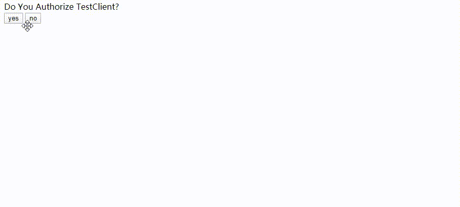

# client_credentials登录
开发准备：
先执行：composer update

1.数据库导入

2.在service.php 设置数据库信息

3.notice：在host 设置oauth2.com 指向本地

获取access_token
http://oauth2.com/token.php

post参数：

client_id：testclient

client_secret：testpass

grant_type：client_credentials  

结果：
{
  "access_token": "a162a7ba26bfc5001551c9a661ac680ef6a396c7",
  "expires_in": 3600,
  "token_type": "Bearer",
  "scope": null
}

>这种模式只需要 秘钥获取access_token

#  授权登录

1.先跳转到一个授权页面，并告诉授权服务器，来授权的是谁，工作的是authorize.php；（这个过程就像qq授权）

http://oauth2.com/authorize.php?response_type=code&client_id=testclient&state=%E8%BF%99%E4%B8%AA%E6%98%AF%E4%BD%A0%E8%A6%81%E5%B8%A6%E7%9A%84%E5%8F%82%E6%95%B0


点击授权

得到一个code

2.用这个code 去换 access_token
http://oauth2.com/token.php

post参数：

```
client_id：testclient

client_secret：testpass

grant_type：authorization_code  //授权模式

code：刚刚获取的code
```


如果成功：
```
{
  "access_token": "e07ff1efcf82d8351d4ea55b79d9d64a77239231",
  "expires_in": 3600,
  "token_type": "Bearer",
  "scope": null,
  "refresh_token": "e71c1b23f146f50cf1d3db721a64bf4efb845f2c"
}

```

# 验证token是否有效

http://oauth2.com/users.php?access_token=你之前获取的access_token

# 资料

https://bshaffer.github.io/oauth2-server-php-docs/


composer require bshaffer/oauth2-server-php

# 如果用redis做储存
```
composer require predis/predis:dev-master
```
在server.php 中添加 同时把pdo 连接的注释掉

比如添加一个用户的时候，同时也要更新redis 中的数据。这么初始化一个clinetid 为testtest ，和pdo获取的一样

```
$predis = new \Predis\Client(['scheme' =>'tcp',' host' =>'localhost','port' =>6379]);

$storage = new OAuth2\Storage\Redis($predis);

$storage->setClientDetails('testtest', 'testpass', 'http://baidu.com/','client_credentials','trut');

```
